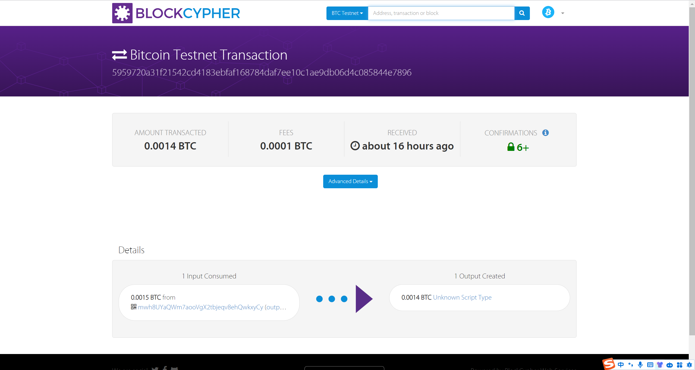
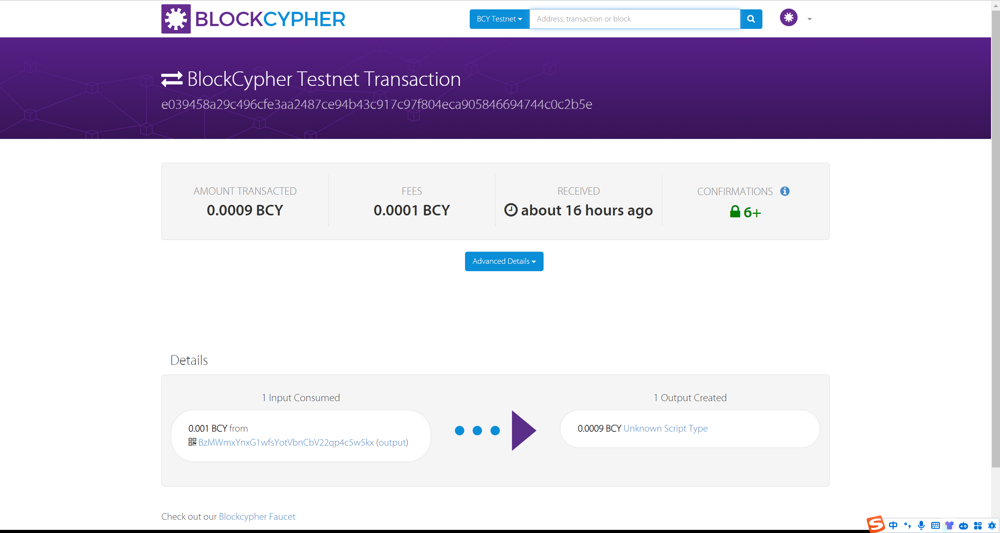
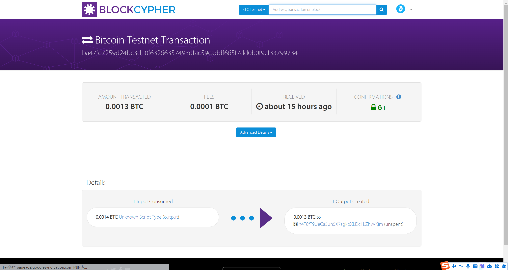
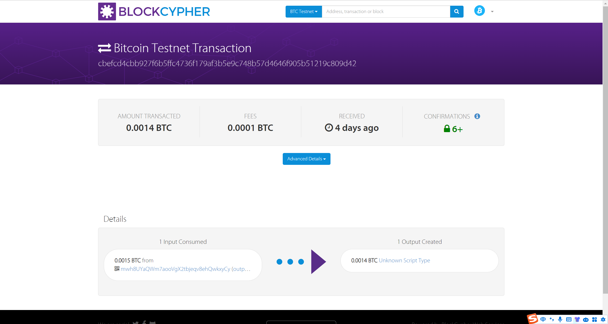
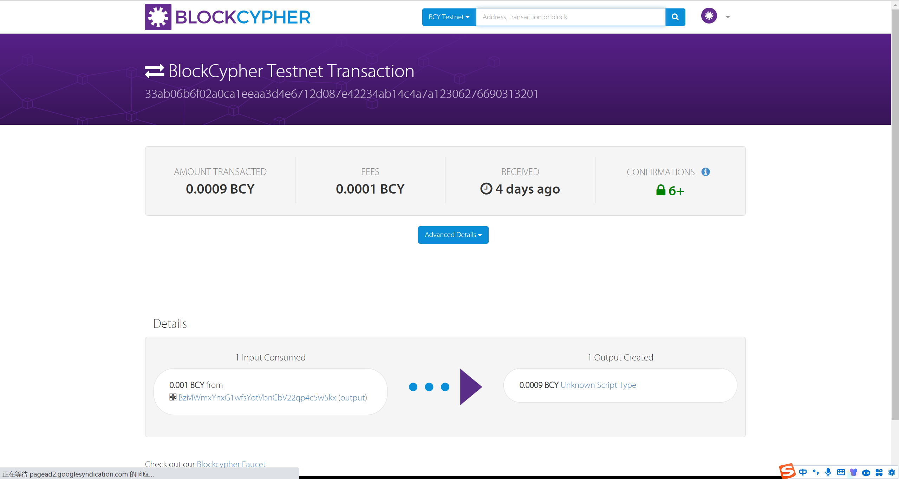
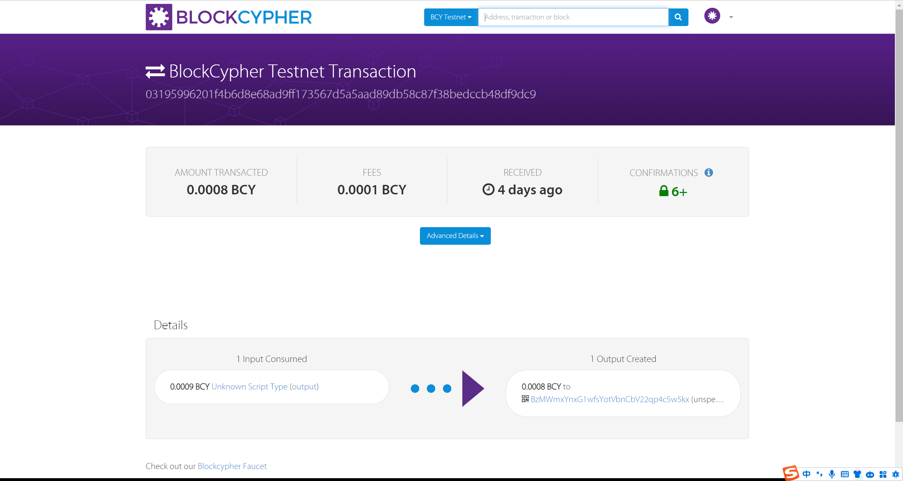
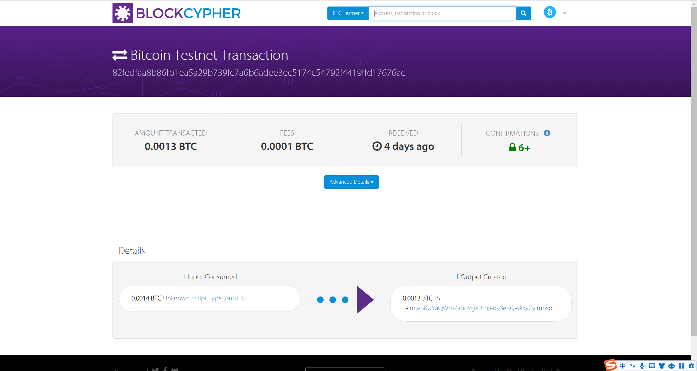

## 区块链第四次作业实验报告
##### 小组成员：罗梓洋（2112957） 刘国民（2113946）


### 一、实验目的

> 本次实验实现了 `Alice` 和 `Bob` 双方的跨链原子交换，即 Alice 使用 `Bitcoin` 来交换 Bob 的 `Blockcypher` 货币。在交易中， 双方可以选择正常交换，也可以选择赎回自己的加密货币。实验难点在于如何保证一方拿到另一方的加密货币后，不能继续拿回自己的货币，从而实现货币交换的公平性和原子性。

### 二、实验原理

> 根据实验要求，我们给出如下步骤来实现交易的原子性和公平性：

1. A 随机选择一个数字 x。
2. A 创建交易 TX1：“如果已知 x 对应的 H(x) 并且由 B 签名，或者由 A 和 B 共同签名，则支付 w 比特币给 B 的公钥。”
3. A 创建交易 TX2：“从交易 TX1 支付 w 比特币给 A 的公钥，这笔交易被锁定在 48 小时后，由 A 签名。”
4. A 将 TX2 发送给 B。
5. B 签名 TX2 并返回给 A。
6. 1）A 将 TX1 提交到网络。
7. B 创建交易 TX3：“如果已知 x 对应的 H(x) 并且由 A 签名，或者由 A 和 B 共同签名，则支付 v 替代币给 A 的公钥。”
8. B 创建交易 TX4：“从交易 TX3 支付 v 替代币给 B 的公钥，这笔交易被锁定在 24 小时后，由 B 签名。”
9. B 将 TX4 发送给 A。
10. A 签名 TX4 并返回给 B。
11. 2）B 将 TX3 提交到网络。
12. 3）A 花费 TX3，揭示 x。
13. 4）B 使用 x 花费 TX1。

> 下面将解释为什么以上步骤可以保证交易的原子性，即如果交易过程中断，无论何时停止，都不会引发问题。

1. 在步骤1）之前：没有公开的信息被广播，没有任何事情发生。
2. 在步骤1）和步骤2）之间：如果交易中断，A 可以在48小时后使用退款交易取回资金。
3. 在步骤2）和步骤3）之间：B 可以在24小时后获得退款。此时A还有额外的24小时来获取他的退款。
4. 在步骤3之后：交易通过步骤2完成。
5. A 必须在24小时内花费新获得的币，否则 B 可以申请退款并保留他的币。
6. B 必须在48小时内花费他新获得的币，否则 A 可以申请退款并保留他的币。

> 同时，如果 A 用 x 解锁了 TX3，花费了新获得的币，那么 x 则会被揭晓，B也可以用 x 来解锁 TX1。同时由于哈希函数的单向性，B
需要知道 x 才能成功解锁 TX1,从而保证了交易的公平性和安全性。

### 三、实验流程

按照实验原理中给出的步骤，我们补充完代码并完成了本次实验。
#### 获取账户、领取测试币以及分币操作
在 Ubuntu 虚拟机上，首先运行 `keygen.py` 程序，获得 Alice 和 Bob 在 BTC 上的私钥和地址。
具体信息如下：
```
Alice:
Private key: cNfACP4sehaV1PLkcQB7NsT8Z6F14DAHZPKjGmVREfajGojSGFQo
Address: mwh8UYaQWm7aooVgX2tbjeqv8ehQwkxyCy

Bob:
Private key: cSJMRN26PJ2mEvCADp9hQd5JQ7bCJRTHH7AqgxPRERVjKFSNza4W
Address: n4T8fT9UeCa5un5X7sgkbXLDc1LZhvVKjm
```

> 然后我们在 BCY 网站上注册账号，申请 Token，通过如下命令获取 Alice 和 Bob 在 BCY 上的私钥和地址信息：
```
curl -X POST https://api.blockcypher.com/v1/bcy/test/addrs?token=cda594183ad04bd3bb5a54a97c4b70df
```

```
Alice:
{
  "private": "c18bdb9ead1f67b18ad7e27ed0896f8e0a7000bf5cab4f23b6decb250b6b6e82",
  "public": "027da9bf86dcf2c9275494cb207f157fd72f65e2cfc9bf214a100d6c266d0831e2",
  "address": "BtUup3oNHLnJ1y9fUrDJoBoAyf5dTknfrd",
  "wif": "BupG1K23TGe8Y7RqRm4yzUbBtJJsrMQ1fbHsUFtP9M6GZvxBGUEs"
}

Bob:
{
  "private": "c49df580d3d1f9c86cb3290ac5b1c56ad9851b5183fea1f2b33fa5c48ab8fd6f",
  "public": "02765d8ee4ba87b7743c6df5e6a8d4c2b53aa4c11987194381209afd28b8786c51",
  "address": "BzMWmxYnxG1wfsYotVbnCbV22qp4c5w5kx",
  "wif": "BuvEDD5yRcVvotHutQuWB6Yfk4nmAJzU79JxogHevoAamPWCYy8U"
}
```


> 之后我们把四个私钥填入到 `keys.py` 中相对应的地方。接下来为 Alice 在 BTC 官网上领取测试币，为 Bob 在 BCY 官网上领取
测试币，并分别把他们获取的币分为十份，相关代码和操作与 Lab1 类似，在此不再赘述。
#####  脚本编写
接下来来到本次实验最关键的地方即是 UTXO 输入输出脚本的编写。下面对脚本进行详细分析。
代码如下：
```python
def coinExchangeScript(public_key_sender, public_key_recipient, hash_of_secret):
    return [
        # 首先验证recipient的签名
        public_key_recipient,
        OP_CHECKSIGVERIFY,
        
        # 如果是sender的签名，则对应发送者拿回自己币的情形
        OP_IF,
        public_key_sender,
        OP_CHECKSIG,
        # 如果是H(x)，则对应接收者用 x 交换币的情形
        OP_ELSE,
        OP_HASH160,
        hash_of_secret,
        OP_EQUAL,
        OP_ENDIF
    ]

# This is the ScriptSig that the receiver will use to redeem coins
def coinExchangeScriptSig1(sig_recipient, secret):
    return [
        # 先把随机数 x 入栈
        secret,
        # 用于跟锁定脚本的OP_ELSE相对应
        OP_0,
        sig_recipient
    ]

# This is the ScriptSig for sending coins back to the sender if unredeemed
def coinExchangeScriptSig2(sig_sender, sig_recipient):
    return [
        # 先把sender签名入栈
        sig_sender,
        # 用于跟锁定脚本的OP_IF相对应
        OP_1,
        sig_recipient
    ]
```

**将锁定和解锁脚本组合起来，我们首先分析交换成功的情形：**
> `coinExchangeScriptSig1` 将 `secret、OP_0和 sig_recipient` 依次压入栈中，接下来 `coinExchangeScript`将 `public_key_recipient` 压入栈中，`OP_CHECKSIGVERIFY` 比较栈顶两个元素是否相等，相等则继续执行，不相等则终止执行。验证成功后，栈中还剩 `secret` 和 `OP_0`，根据 `OP_IF` 的含义，栈顶为 0 则执行 `OP_ELSE` 的内容，同时栈顶的 0 出栈，此时栈中还剩 secret，接下来 `OP_HASH160` 将 secret 进行哈希，并将 `hash_of_secret` 压入栈中，最后通过 `OP_EQUAL` 比较栈顶这两个值是否相等，如果相等则返回1，脚本解锁成功。

**接下来我们分析交换失败的情形：**
> coinExchangeScriptSig2 将 sig_sender、OP_1和 sig_recipient 依次压入栈中，逻辑与上面的情形类似，先验证 sig_recipient，之后由于栈顶是 OP_1，执行 `OP_IF`的内容，OP_1 出栈。此时栈中还剩 `sig_sender`，之后执行 OP_IF 后边的内容，将 `public_key_sender` 压入栈中，`OP_CHECKSIG` 来比较栈顶的两个元素是否相等，相等则返回1，脚本解锁成功。

> 综上所述，通过以上的脚本代码可以成功实现算法流程中给出的交易解锁条件，完成本次实验。

#### 分析 swap.py
> swap.py 中设置了 Alice 和 Bob 要交换的币值、引用的 UTXO(即分币后的 tx_id)，以及引用的索引。同时设置了两人的锁定时间以及交易小费，之后设置是否要广播以及 Alice 是否要赎回自己的 Bitcoin。在本次实验中，我们对TT、TF、FT、FF 四种情况都进行了测试，并得到了正确的输出结果。
> swap.py 中的 `def atomic_swap(broadcast_transactions=False, alice_redeems=True)` 函数则是实现了我们给出的算法。alice.alice_swap_tx 对应流程中的 TX1，return_coins_tx 对应流程中的 TX2，Bob 对其签名后， 假定 broadcast_transactions=True，则 Alice 将 TX1广播到全网；Bob 进行的操作与 Alice 类似。之后根据 alice_redeems 的值来判断是否交换，如果为 True，则用  `redeem_swap` 来解锁 TX1，并进行广播，Bob 类似；如果为 False,Alice 则 complete_return_tx 来解锁 TX2,Bob也是类似，并进行广播。broadcast_transactions为 False 时则不进行广播，运行时会输出相应的提示语。


### 思考题&回答

- **解释你写的代码内容，以及 coinExchangeScript 是如何工作的。**

> 答：代码和脚本分析见上。

- **以 Alice 用 coinExchangeScript 向 Bob 发送硬币为例：如果 Bob 不把钱赎回来，Alice 为什么总能拿回她的钱？为什么不能用简单的 1/2 multisig 来解决这个问题？**

> 答：对于问题一：这是因为在经过48个小时的锁定时间后，Alice 可以用自己的签名解锁 TX2，从而拿回自己的钱。对于问题二：这是因为 1/2 multisig 无法结合时间锁定和哈希锁定来保证交易的原子性。如果使用了1/2 multisig，可能会发生连续赎回自己发出的钱和对方发送的钱的问题。


- **解释 Alice (Bob) 创建的一些交易内容和先后次序，以及背后的设计原理。**

> 答：在一次跨链原子交易中，一共创建了四个交易。先后次序是：
- TX1: Alice 支付给 Bob 的比特币，解锁条件为 SigA && SigB 或者 SigB && H(x)
- TX2: 从交易 TX1 支付给 Alice 的比特币，这笔交易被锁定在 48 小时后，解锁条件为 SigA
- TX3: Bob 支付给 Alice 的 BCY，解锁条件为 SigA && SigB 或者 SigA && H(x)
- TX4: 从交易 TX3 支付给 Bob 的 BCY，这笔交易被锁定在 24 小时后，解锁条件为 SigB

设计原理：
- TX1 (由Alice创建): 这个交易是Alice向Bob支付一定数量的比特币的承诺，但这个承诺有条件。确保只有当特定条件（秘密数字x的揭示）满足时，Bob才能实际上领取这些资金。

- TX2 (由Alice创建，发送给Bob): 这是一个退款交易，它允许Alice在特定时间后（如果Bob未能满足TX1的条件）收回她的资金。这个交易被设计为时间锁定，防止Alice过早取回资金，给Bob足够的时间来完成交易。

- TX3 (由Bob创建): 类似于TX1，这是Bob向Alice支付另一种货币（如替代币）的承诺。同样，这个承诺附带条件，需要 Alice 提供秘密数字x才能赎回。

- TX4 (由Bob创建，发送给Alice): 这是Bob的退款交易，类似于TX2，它允许Bob在特定条件未满足时收回他的资金。这个交易同样设置了时间锁定，以确保交易的公平性。

这四个交易共同确保了整个跨链交换的原子性：哈希函数确保了交易的密钥部分 x 必须被透露，才能允许任一方取得对方的资金。时间锁定为交易提供了时间窗口，确保交易双方有机会在特定时间内完成所需的动作，否则允许他们撤回自己的资金。

- **以该作业为例，一次成功的跨链原子交换中，数字货币是如何流转的？如果失败，数字货币又是如何流转的？**

> 答：一次成功的交易中：
1. Alice 首先创建交易 TX1，输出的地址即为 Bob 的公钥，此时由于脚本锁定，Bob 还没有获得这部分数字货币；
2. Bob 创建交易 TX3，输出的地址为 Alice 的公钥，此时 Alice 已经可以解锁该交易从而获取这部分数字货币；
3. Alice 用 H(x) 来解锁 TX3，Bob 的数字货币流转到 Alice 的地址上，同时由于解锁需要 H(x)，x 也被公布给 Bob，Bob 使用 H(x) 来解锁 TX1，Alice 的数字货币流转到 Bob 的地址上。此时数字货币都已成功转移到对方账户里。但需注意：Alice 需要在24小时之内花出新获得的币，否则 Bob 可以使用自己的签名解锁 TX4，从而花费 TX3 中的输出；与此类似，Bob 也需要在48小时内花出新获得的币。如果双方未及时花出新获得的币，数字货币可能会流回对方的账户里。

> 而对于一次失败的交易：
在 TX1、TX2、TX3和TX4成功创建后，Alice 想拿回自己的数字货币，需要等到 TX2 锁定时间结束后，通过自己的签名来解锁 TX1 和 TX2，此时数字货币在流转到 Bob 的地址后又立刻流转回了 Alice 的地址。在锁定时间内，Bob 由于拿不到 x 的哈希值，也无法解锁 TX1。同样的，Bob 也可以通过类似的操作拿回自己的数字货币。

### 实验结果

#### 不广播不赎回

Alice没有对Bob的交换交易进行赎回，因此Bob的返还交易在锁定时间结束后将比特币退回，之后因为Bob没有赎回Alice的交换交易，Alice的返还交易在锁定时间之后将比特币退回。如下为该情况的输出结果，符合流程。

```
Alice swap tx (BTC) created successfully!
Bob swap tx (BCY) created successfully!
Bob return coins (BCY) tx created successfully!
Alice return coins tx (BTC) created successfully!
```

#### 不广播但赎回

Alice对Bob的交换交易进行赎回，并广播秘密，这样Bob也使用秘密和自己的签名将Alice的交换交易赎回，原子交换成功。如下输出符合流程。

```
Alice swap tx (BTC) created successfully!
Bob swap tx (BCY) created successfully!
Alice redeem from swap tx (BCY) created successfully!
Bob redeem from swap tx (BTC) created successfully!
```

#### 广播且赎回

- 完整输出文档见下：

```json
Alice swap tx (BTC) created successfully!
201 Created
{
  "tx": {
    "block_height": -1,
    "block_index": -1,
    "hash": "5959720a31f21542cd4183ebfaf168784daf7ee10c1ae9db06d4c085844e7896",
    "addresses": [
      "mwh8UYaQWm7aooVgX2tbjeqv8ehQwkxyCy"
    ],
    "total": 140000,
    "fees": 10000,
    "size": 263,
    "vsize": 263,
    "preference": "low",
    "relayed_by": "60.29.153.62",
    "received": "2023-11-13T08:56:40.349427323Z",
    "ver": 1,
    "double_spend": false,
    "vin_sz": 1,
    "vout_sz": 1,
    "confirmations": 0,
    "inputs": [
      {
        "prev_hash": "58b89939513596a06503e4a9394b4a0ab358e0fa909f5bac1653b7465760c62e",
        "output_index": 7,
        "script": "473044022039d0d5e83dec9aedaba68252984762105367fc7d5876778f75291fd8b1f5445b02203006f2104337f262ac745107980a110cecbb010a84719d53a96cba7f401b9b03012102381007778d40fca847fce3bfa7a526f4de42719073fa5e8212b8d91956c41710",
        "output_value": 150000,
        "sequence": 4294967295,
        "addresses": [
          "mwh8UYaQWm7aooVgX2tbjeqv8ehQwkxyCy"
        ],
        "script_type": "pay-to-pubkey-hash",
        "age": 2537472
      }
    ],
    "outputs": [
      {
        "value": 140000,
        "script": "76a914853b775079232503df966e626618e1d388a957208763752103424449d3de7b1c6a7eb13e6da328ebff02b19caf6d1496b64b0919e3403703dc672102381007778d40fca847fce3bfa7a526f4de42719073fa5e8212b8d91956c4171068ac",
        "addresses": null,
        "script_type": "unknown"
      }
    ]
  }
}
Bob swap tx (BCY) created successfully!
201 Created
{
  "tx": {
    "block_height": -1,
    "block_index": -1,
    "hash": "e039458a29c496cfe3aa2487ce94b43c917c97f804eca905846694744c0c2b5e",
    "addresses": [
      "BzMWmxYnxG1wfsYotVbnCbV22qp4c5w5kx"
    ],
    "total": 90000,
    "fees": 10000,
    "size": 263,
    "vsize": 263,
    "preference": "low",
    "relayed_by": "117.131.219.41",
    "received": "2023-11-13T08:56:41.559697303Z",
    "ver": 1,
    "double_spend": false,
    "vin_sz": 1,
    "vout_sz": 1,
    "confirmations": 0,
    "inputs": [
      {
        "prev_hash": "354298c9ae98b7addecc47473826f5001fd1d94169191a8d124e9a1980ec0d7c",
        "output_index": 7,
        "script": "47304402201c26640f36dac477313fbf6f55a901a82dedf3b6e74bd25cd7172bcb2175897d02200e6b50110c911a172eef2f8a6792ec589a507c912164afb9dcaeac08a0e74c5e012102765d8ee4ba87b7743c6df5e6a8d4c2b53aa4c11987194381209afd28b8786c51",
        "output_value": 100000,
        "sequence": 4294967295,
        "addresses": [
          "BzMWmxYnxG1wfsYotVbnCbV22qp4c5w5kx"
        ],
        "script_type": "pay-to-pubkey-hash",
        "age": 1058845
      }
    ],
    "outputs": [
      {
        "value": 90000,
        "script": "76a914853b775079232503df966e626618e1d388a9572087637521027da9bf86dcf2c9275494cb207f157fd72f65e2cfc9bf214a100d6c266d0831e2672102765d8ee4ba87b7743c6df5e6a8d4c2b53aa4c11987194381209afd28b8786c5168ac",
        "addresses": null,
        "script_type": "unknown"
      }
    ]
  }
}
Sleeping for 20 minutes to let transactions confirm...
Alice redeem from swap tx (BCY) created successfully!
201 Created
{
  "tx": {
    "block_height": -1,
    "block_index": -1,
    "hash": "0782fac18944be792af91cf3ace33b8e238f6643e77645c6ae0db371d0f9f5f9",
    "addresses": [
      "BtUup3oNHLnJ1y9fUrDJoBoAyf5dTknfrd"
    ],
    "total": 80000,
    "fees": 10000,
    "size": 182,
    "vsize": 182,
    "preference": "low",
    "relayed_by": "221.238.245.38",
    "received": "2023-11-13T09:16:42.667719961Z",
    "ver": 1,
    "double_spend": false,
    "vin_sz": 1,
    "vout_sz": 1,
    "confirmations": 0,
    "inputs": [
      {
        "prev_hash": "e039458a29c496cfe3aa2487ce94b43c917c97f804eca905846694744c0c2b5e",
        "output_index": 0,
        "script": "4730440220600f5c3c29e13c2472ee5ad0a3bf395a012c261ac7bcadab5708ca05a0afd6ba022065f6941f49b6f8c51e03c86f79898dbbaf24aa1fca645c5ac6c7090280039fad01187468697349734153656372657450617373776f7264313233",
        "output_value": 90000,
        "sequence": 4294967295,
        "script_type": "unknown",
        "age": 1066158
      }
    ],
    "outputs": [
      {
        "value": 80000,
        "script": "76a9140edeaf61908044798e2f16937f79ff3daca72dba88ac",
        "addresses": [
          "BtUup3oNHLnJ1y9fUrDJoBoAyf5dTknfrd"
        ],
        "script_type": "pay-to-pubkey-hash"
      }
    ]
  }
}
Bob redeem from swap tx (BTC) created successfully!
201 Created
{
  "tx": {
    "block_height": -1,
    "block_index": -1,
    "hash": "ba47fe7259d24bc3d10f63266357493dfac59caddf665f7dd0b0f9cf33799734",
    "addresses": [
      "n4T8fT9UeCa5un5X7sgkbXLDc1LZhvVKjm"
    ],
    "total": 130000,
    "fees": 10000,
    "size": 183,
    "vsize": 183,
    "preference": "low",
    "relayed_by": "117.131.219.41",
    "received": "2023-11-13T09:16:43.804346613Z",
    "ver": 1,
    "double_spend": false,
    "vin_sz": 1,
    "vout_sz": 1,
    "confirmations": 0,
    "inputs": [
      {
        "prev_hash": "5959720a31f21542cd4183ebfaf168784daf7ee10c1ae9db06d4c085844e7896",
        "output_index": 0,
        "script": "483045022100d9a9e31c8c5bc362be4ece7427ac1e57a75c21b911b12c2bfe3d82e9851f7b5502201df50c2179539a3017d2f3028131d45e1db4d07406b8ed79cbcb2453d0f3adce01187468697349734153656372657450617373776f7264313233",
        "output_value": 140000,
        "sequence": 4294967295,
        "script_type": "unknown",
        "age": 2538237
      }
    ],
    "outputs": [
      {
        "value": 130000,
        "script": "76a914fb91e27d1d1925dee07280a7e91db98f67a541c088ac",
        "addresses": [
          "n4T8fT9UeCa5un5X7sgkbXLDc1LZhvVKjm"
        ],
        "script_type": "pay-to-pubkey-hash"
      }
    ]
  }
}
```

- faucet截图

  Bob对Alice创建的返还交易即tx2进行签名后，Alice广播交换交易即tx1，tx1的确认结果：



​		创建的交换交易即tx3，Alice对Bob创建的返还交易即tx4进行签名后，Bob广播交换交易即tx3，tx3的确认结果：



​		Alice赎回Bob创建的交换交易即tx3，该赎回交易的确认结果：


​		Bob赎回Alice创建的交换交易即tx1，该赎回交易的确认结果：



#### 广播但不赎回

- 完整输出文档见下：

```json
Alice swap tx (BTC) created successfully!
201 Created
{
  "tx": {
    "block_height": -1,
    "block_index": -1,
    "hash": "cbefcd4cbb927f6b5ffc4736f179af3b5e9c748b57d4646f905b51219c809d42",
    "addresses": [
      "mwh8UYaQWm7aooVgX2tbjeqv8ehQwkxyCy"
    ],
    "total": 140000,
    "fees": 10000,
    "size": 266,
    "vsize": 266,
    "preference": "low",
    "relayed_by": "60.29.153.35",
    "received": "2023-11-09T02:45:58.921573154Z",
    "ver": 1,
    "double_spend": false,
    "vin_sz": 1,
    "vout_sz": 1,
    "confirmations": 0,
    "inputs": [
      {
        "prev_hash": "58b89939513596a06503e4a9394b4a0ab358e0fa909f5bac1653b7465760c62e",
        "output_index": 4,
        "script": "47304402206277b188ba308aa46749d25c9e7b3850d357ae96fb6365d035e90ab5b66cdb0002201115de7d933c0a1b455f386142dc4cb728234be70d6ce893636b5e8a6ed610a6012102381007778d40fca847fce3bfa7a526f4de42719073fa5e8212b8d91956c41710",
        "output_value": 150000,
        "sequence": 4294967295,
        "addresses": [
          "mwh8UYaQWm7aooVgX2tbjeqv8ehQwkxyCy"
        ],
        "script_type": "pay-to-pubkey-hash",
        "age": 2537472
      }
    ],
    "outputs": [
      {
        "value": 140000,
        "script": "2103424449d3de7b1c6a7eb13e6da328ebff02b19caf6d1496b64b0919e3403703dcac75762102381007778d40fca847fce3bfa7a526f4de42719073fa5e8212b8d91956c41710ac63755167a914853b775079232503df966e626618e1d388a957208768",
        "addresses": null,
        "script_type": "unknown"
      }
    ]
  }
}
Bob swap tx (BCY) created successfully!
201 Created
{
  "tx": {
    "block_height": -1,
    "block_index": -1,
    "hash": "33ab06b6f02a0ca1eeaa3d4e6712d087e42234ab14c4a7a12306276690313201",
    "addresses": [
      "BzMWmxYnxG1wfsYotVbnCbV22qp4c5w5kx"
    ],
    "total": 90000,
    "fees": 10000,
    "size": 267,
    "vsize": 267,
    "preference": "low",
    "relayed_by": "221.238.245.31",
    "received": "2023-11-09T02:46:21.082170656Z",
    "ver": 1,
    "double_spend": false,
    "vin_sz": 1,
    "vout_sz": 1,
    "confirmations": 0,
    "inputs": [
      {
        "prev_hash": "354298c9ae98b7addecc47473826f5001fd1d94169191a8d124e9a1980ec0d7c",
        "output_index": 4,
        "script": "483045022100cb7fe66d25dd1b265bde843f05551f1c057a3f3df35cbf85b5e2a431555cc006022031dc2fe5cf6c0bc2facfa39b9284628320efd3982015560e5fa2fdb7ccdc6e4f012102765d8ee4ba87b7743c6df5e6a8d4c2b53aa4c11987194381209afd28b8786c51",
        "output_value": 100000,
        "sequence": 4294967295,
        "addresses": [
          "BzMWmxYnxG1wfsYotVbnCbV22qp4c5w5kx"
        ],
        "script_type": "pay-to-pubkey-hash",
        "age": 1058845
      }
    ],
    "outputs": [
      {
        "value": 90000,
        "script": "21027da9bf86dcf2c9275494cb207f157fd72f65e2cfc9bf214a100d6c266d0831e2ac75762102765d8ee4ba87b7743c6df5e6a8d4c2b53aa4c11987194381209afd28b8786c51ac63755167a914853b775079232503df966e626618e1d388a957208768",
        "addresses": null,
        "script_type": "unknown"
      }
    ]
  }
}
Sleeping for 20 minutes to let transactions confirm...
Bob return coins (BCY) tx created successfully!
Alice return coins tx (BTC) created successfully!
Sleeping for bob_locktime blocks to pass locktime...
201 Created
{
  "tx": {
    "block_height": -1,
    "block_index": -1,
    "hash": "03195996201f4b6d8e68ad9ff173567d5a5aad89db58c87f38bedccb48df9dc9",
    "addresses": [
      "BzMWmxYnxG1wfsYotVbnCbV22qp4c5w5kx"
    ],
    "total": 80000,
    "fees": 10000,
    "size": 229,
    "vsize": 229,
    "preference": "low",
    "relayed_by": "221.238.245.38",
    "received": "2023-11-09T09:40:24.25523279Z",
    "ver": 1,
    "lock_time": 1058846,
    "double_spend": false,
    "vin_sz": 1,
    "vout_sz": 1,
    "confirmations": 0,
    "inputs": [
      {
        "prev_hash": "33ab06b6f02a0ca1eeaa3d4e6712d087e42234ab14c4a7a12306276690313201",
        "output_index": 0,
        "script": "47304402202cceba8e3026a64a3c7d9297bff5c2030f1e198f78bcb82baec5e0a823481bfd022005218b8ab32270871f19c503c345f9f109f03094a2c2167a048b3fdb09b171a70147304402205aec82db87541258d04207d712df91ae778a4d17b1119b659ad64b73257e53f302203adb5e2ff866da6e977f1bba0825c49fde9b37d7ce0811b4e9b45059e4021cc601",
        "output_value": 90000,
        "sequence": 4294967295,
        "script_type": "unknown",
        "age": 1060029
      }
    ],
    "outputs": [
      {
        "value": 80000,
        "script": "76a9144f494c6c91f0a733bb413fd526df22fbb7d140ab88ac",
        "addresses": [
          "BzMWmxYnxG1wfsYotVbnCbV22qp4c5w5kx"
        ],
        "script_type": "pay-to-pubkey-hash"
      }
    ]
  }
}
Sleeping for alice_locktime blocks to pass locktime...
201 Created
{
  "tx": {
    "block_height": -1,
    "block_index": -1,
    "hash": "82fedfaa8b86fb1ea5a29b739fc7a6b6adee3ec5174c54792f4419ffd17676ac",
    "addresses": [
      "mwh8UYaQWm7aooVgX2tbjeqv8ehQwkxyCy"
    ],
    "total": 130000,
    "fees": 10000,
    "size": 231,
    "vsize": 231,
    "preference": "low",
    "relayed_by": "60.29.153.62",
    "received": "2023-11-09T09:50:25.839041444Z",
    "ver": 1,
    "lock_time": 2537474,
    "double_spend": false,
    "vin_sz": 1,
    "vout_sz": 1,
    "confirmations": 0,
    "inputs": [
      {
        "prev_hash": "cbefcd4cbb927f6b5ffc4736f179af3b5e9c748b57d4646f905b51219c809d42",
        "output_index": 0,
        "script": "483045022100b281e7066298b9a11f66491d4b6681120a9abd9c77fe5a2098db530f305e3f0d02203ed1ec72f886c6dea156e3745f36796c261738fd09f4755a437f0f8ebce01d4f01483045022100bff540dd85cd3fe744b8cda9a79ffd395a85a54d6484c1ccac758acc9258793a022023446138af37e1953c19e621672e6d95b7620be2479c501f4cc112456359a33601",
        "output_value": 140000,
        "sequence": 4294967295,
        "script_type": "unknown",
        "age": 2537613
      }
    ],
    "outputs": [
      {
        "value": 130000,
        "script": "76a914b16eabb50d972569c9e920114df39b4c1f21252388ac",
        "addresses": [
          "mwh8UYaQWm7aooVgX2tbjeqv8ehQwkxyCy"
        ],
        "script_type": "pay-to-pubkey-hash"
      }
    ]
  }
}
```

- faucet截图

​		tx1的确认结果：



​		tx3的确认结果：



​		由于Alice没有进行赎回，`bob_locktime`之后tx4的确认结果：



​		`alice_locktime`之后tx2的确认结果：

