## <center>区块链Lab5实验报告</center>
**<center>小组成员：2112957-罗梓洋 2113946-刘国民</center>**

### 实验代码
实验代码主要分为后端部署智能合约的部分和前端用户交互的部分。两部分分别
用 Solidity 和 JavaScript 实现。

#### Solidity源码
```solidity
// Please paste your contract's solidity code here
// Note that writing a contract here WILL NOT deploy it and allow you to access it from your client
// You should write and develop your contract in Remix and then, before submitting, copy and paste it here
pragma solidity >=0.7 <0.9.0;

contract BlockchainSplitwise {
    //债务代表所欠的一些金额。最大可能值
	//债务为2^32 ~= 4 billion。我们在合同中进行溢出检查。
    struct Debt {
        uint32 amount;
    }
    
    // 跟踪债务。从债务人映射到映射从债权人到债务。
    // 例如，debts[Alice][Bob] = 10 意味着爱丽丝欠鲍勃10块钱。
    mapping(address=>mapping(address=>Debt)) internal all_debts;
    
    // 查找债务人欠债权人的债务总额.
    function lookup(address debtor, address creditor) public view returns (uint32 ret) {
        ret = all_debts[debtor][creditor].amount;
    }
    
    // 添加了msg.sender欠债主更多美元的事实
    // 路径可以是从债权人到msg.sender的现有路径，这意味着通过添加此IOU将创建一个循环min_on_cycle”是建议的周期最低金额，该金额将从路径上的所有债务中删除（包括正在添加的借条）
    //
    // 该函数验证以下内容：
    //    1. 若给出了路径，它确实存在，并将债权人和债务人联系起来。
    //    2. min_on_cycle必须是循环上的最小值。
    function add_IOU(address creditor, uint32 amount,  address[] memory path, uint32 min_on_cycle) public {
        address debtor = msg.sender;
        
        require(debtor != creditor, "Creditor cannot be creditor.");
        
        Debt storage iou = all_debts[debtor][creditor];  // assigns a reference
        
        // 检查是否溢出。
        if (min_on_cycle == 0) {
            // No cycles, just add the IOU and return.
            iou.amount = add(iou.amount, amount);
            return;
        }
        // 验证min_on_cycle始终是直接欠下的金额（因为这是循环欠款的末端）
        require(min_on_cycle <= (iou.amount + amount), "Error!");
        // 验证从债权人到债务人的给定路径是否存在。如果是，它会修复路径。
        require(verify_and_fix_path(creditor, debtor, path, min_on_cycle), "Error!");
        // 添加新的欠条，因为它不会产生循环。
        iou.amount = add(iou.amount, (amount - min_on_cycle));
    }
    
    // 验证路径是否有效并修复它。路径可以是部分固定的，所以调用者负责撤消部分固定的路径。最简单的方法是使用require（），因为这将回滚事务。
    function verify_and_fix_path(address start, address end, address[] memory path, uint32 min_on_cycle) private returns (bool ret) {
        if (start != path[0] || end != path[path.length - 1]) {
            return false;
        }
        // 我们愿意检查的Maximu路径大小为10，不包括开始和结束。
        if (path.length > 12) {
            return false;
        }
        for (uint i = 1; i < path.length; i++) {
            // 如果债务不存在或小于min_on_cycle，这是无效的。
            Debt storage iou = all_debts[path[i-1]][path[i]];
            if (iou.amount == 0 || iou.amount < min_on_cycle) {
                return false;
            }
            // 否则，它是有效的，所以我们继续修复它。
            else {
                iou.amount -= min_on_cycle;
            }
        }
        return true;
    }
    
    // 带溢出检查的添加.
    function add(uint32 a, uint32 b) internal pure returns (uint32) {
      uint32 c = a + b;
      require(c >= a);
      return c;
    }
}
```
Solidity 代码如上。代码定义了一个合约，该合约旨在用于区块链上的债务追踪和结算，通过添加债务和查询债务金额来实现债务管理。

- 合约中保存 `mapping`状态变量，用来记录债务人和债权人的关系，以及所欠的金额。`lookup` 函数用来查询这个` mapping `变量，为了保证债务数据不被恶意篡改，查询时将函数声明为` view` 表示只读，同时` mapping` 变量缺省为` internal `即只能在合约内部访问。
- `add_IOU` 函数即是在账簿上增加一笔 IOU欠条，代码具体含义可从注释中看到。注意这里为了减少 gas,我们将寻找环以及寻找环中最小边的任务放在前端的 js文件中实现。js调用时再把函数参数传入即可。
-  `verify_and_fix_path`函数的功能验证路径的有效性，并在必要的情况下修复路径。

#### Javascript源码（用户客户端编写）

```javascript
// =============================================================================
//                            Functions To Implement 
// =============================================================================

function getCallData(extractor_fn, early_stop_fn) {
	const results = new Set();
	const all_calls = getAllFunctionCalls(contractAddress, 'add_IOU', early_stop_fn);
	for (var i = 0; i < all_calls.length; i++) {
		const extracted_values = extractor_fn(all_calls[i]);
		for (var j = 0; j < extracted_values.length; j++) {
			results.add(extracted_values[j]);
		}
	}
	return Array.from(results);
}
```

这段代码的目的是通过提供的提取器函数`extractor_fn`从区块链中获取所有`add_IOU`函数的调用，并将提取到的值进行去重后返回。

```javascript
function getCreditors() {
	return getCallData((call) => {
		// call.args[0] is the creditor.
		return [call.args[0]];
	}, /*early_stop_fn=*/null);
}

function getCreditorsForUser(user) {
	var creditors = []
	const all_creditors = getCreditors()
	for (var i = 0; i < all_creditors.length; i++) {
		const amountOwed = BlockchainSplitwise.lookup.call(user, all_creditors[i]).toNumber();
		if (amountOwed > 0) {
			creditors.push(all_creditors[i])
		}
	}
	return creditors;
}
```

通过调用`getCallData()`函数获取所有债权人列表，并使用循环遍历该列表，查询每个债权人与给定用户之间的欠款关系。最终，返回所有实际存在欠款关系的债权人列表。

```javascript
function findMinOnPath(path) {
	var minOwed = null;
	for (var i = 1; i < path.length; i++) {
		const debtor = path[i-1]
		const creditor = path[i];
		const amountOwed = BlockchainSplitwise.lookup.call(debtor, creditor).toNumber();
		if (minOwed == null || minOwed > amountOwed) {
			minOwed = amountOwed;
		}
	}
	return minOwed;
}
```

这段代码的目的是在给定路径上找到最小的欠款金额。它通过查询每个节点之间的债务金额，并记录最小的金额，最后返回最小欠款金额。

```javascript
//getUsers函数用于获取系统中的用户列表。
function getUsers() {
	return getCallData((call) => {
		// call.from is debtor and call.args[0] is creditor.
		return [call.from, call.args[0]]
	}, /*early_stop_fn=*/null);
}

//getTotalOwed函数用于获取指定用户所欠债务的总额。
function getTotalOwed(user) {
	// We assume lookup is up-to-date (all cycles removed).
	var totalOwed = 0;
	const all_creditors = getCreditors();
	for (var i = 0; i < all_creditors.length; i++) {
		totalOwed += BlockchainSplitwise.lookup.call(user, all_creditors[i]).toNumber();
	}
	return totalOwed;
}
//getLastActive函数用于获取与指定用户相关的通话记录中，最后一次通话的时间戳，即用户最后一次活跃的时间。
function getLastActive(user) {
	const all_timestamps = getCallData((call) => {
		if (call.from == user || call.args[0] == user) {
			return [call.timestamp];
		}
		return [];
	}, (call) => {
		// Return early as soon as you find this user.
		return call.from == user || call.args[0] == user;
	});
	return Math.max(all_timestamps);

}
```

```javascript
function add_IOU(creditor, amount) {
	// Assume debtor is the one issuing the transaction.
	const debtor = web3.eth.defaultAccount;
	// If there's an existing path from creditor -> debtor (eg, creditor owes debtor),
	// rather than add the IOU immediately, find the path and find the minimum
	// along the path.
	const path = doBFS(creditor, debtor, getCreditorsForUser);
	if (path != null) {
		const min_on_cycle = Math.min(findMinOnPath(path), amount);
		// Now add the IOU, letting the contract know about any possible cycles.
		return BlockchainSplitwise.add_IOU(creditor, amount, path, min_on_cycle);
	}
	// There is no cycle, just add the IOU.
	var x = BlockchainSplitwise.add_IOU(creditor, amount, [], /*min_on_cycle=*/0);
	return;
}
```

这段代码的主要逻辑是**对添加债务（IOU）的操作进行处理**。 

1. 首先，通过参数`creditor`和`amount`获取债务的债权人和金额。
2. 假设债务人为`debtor`，使用`web3.eth.defaultAccount`获取默认账户。 
3. 如果从债权人到债务人存在路径（例如，债权人欠债务人的情况），则不立即添加债务，而是通过广度优先搜索（BFS）寻找路径，并找出路径上的最小值。
4. 如果存在路径，则通过`BlockchainSplitwise.add_IOU()`将债务添加到合约中，并将路径和最小值作为参数传递。
5.  如果不存在路径，则直接通过`BlockchainSplitwise.add_IOU()`将债务添加到合约中，并将路径和最小值设为默认值。

### 实验过程

1. 编写和编译合约：在`Remix`中编写智能合约代码，使用 Remix 编译器编译合约。
   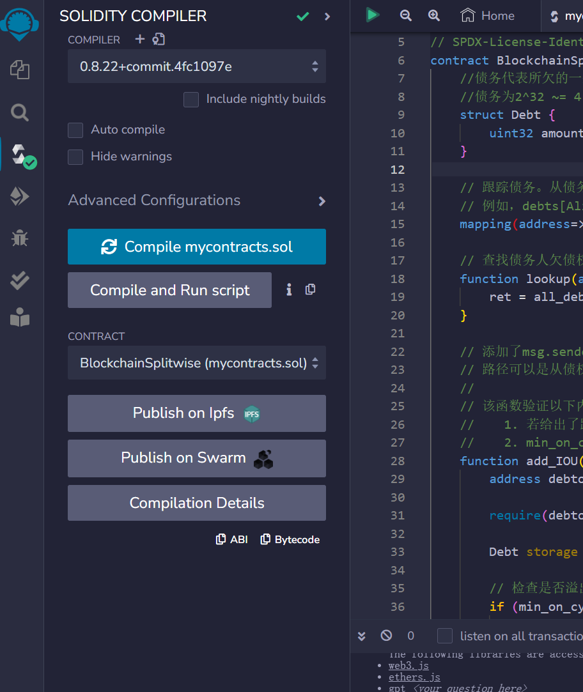
2. 可以看到，已经编译成功。接下来在本地运行以太坊节点。实测这里需要安装`ganache`而不是`ganache-cli`，安装后者在部署的时候会报错。
   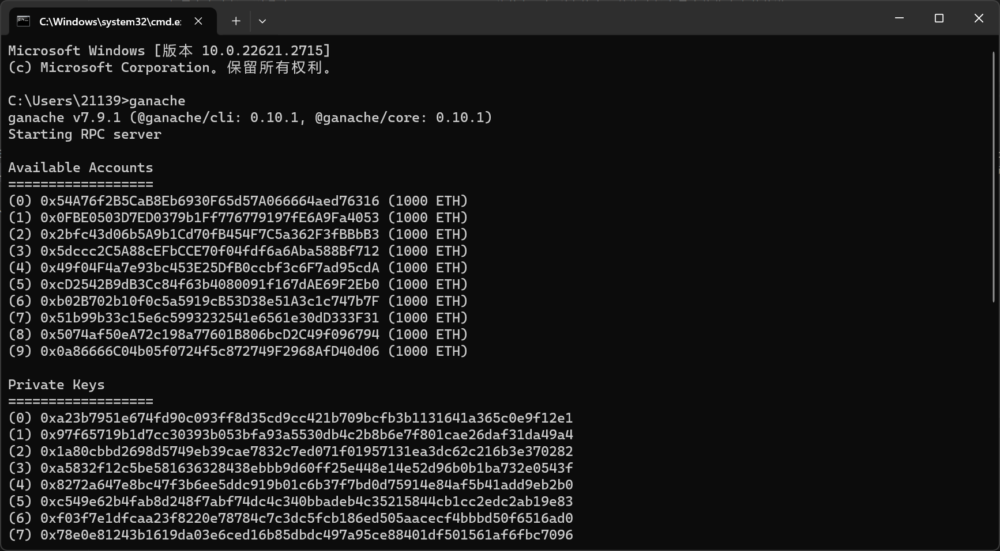
3. 节点成功运行，并输出了创建的10个预先配置好的以太坊账户，包含1000个初始的以太币（模拟币）用于测试和开发。节点成功运行后默认监听 localhost 的8545端口。所以下面我们配置环境的时候也需要选择这一端口进行连接。在 Remix 中选择环境（Custom - External Http Provider），即后续会将合约部署在本地节点上。
   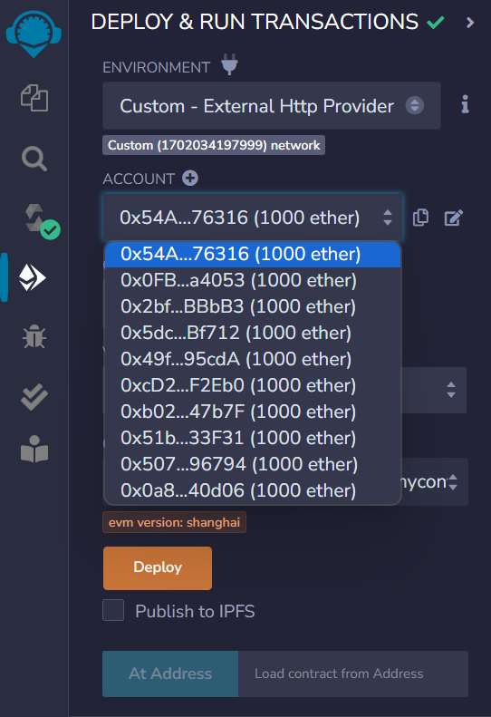
4. 账户地址与 cmd 中给出的地址相同，说明连接成功。之后点击 Deploy 部署合约。这会生成一个部署在特定网络（这里即为本地网络）节点上的合约实例。
   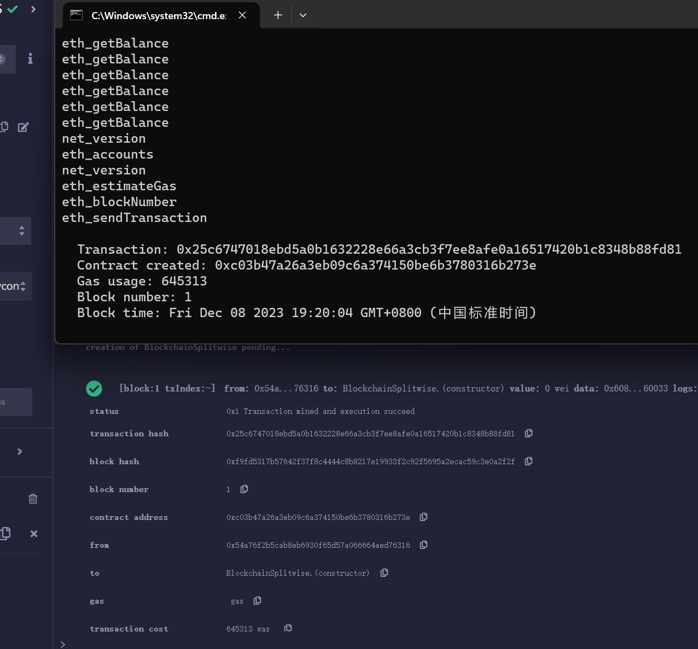
   从 Remix 的输出终端看到，合约成功部署。同时 cmd 中也输出了合约的基本信息，下面对 cmd 输出的信息做一个简单的分析。

```yml
   Transaction: 0x25c6747018ebd5a0b1632228e66a3cb3f7ee8afe0a16517420b1c8348b88fd81
   Contract created: 0xc03b47a26a3eb09c6a374150be6b3780316b273e
   Gas usage: 645313
   Block number: 1
   Block time: Fri Dec 08 2023 19:20:04 GMT+0800 (中国标准时间)
```
- `Transaction`: 以太坊区块链上的交易，具有唯一的事务哈希值，用于在区块链上标识和跟踪交易
- `Contract created`: 这笔交易创建了一个智能合约。合约的地址是 0xc03b47a26a3eb09c6a374150be6b3780316b273e，后续这个地址会在js中用到。
- `Gas usage`: 即部署合约所消耗的 gas，用来支付网络上的计算和存储成本。
- `Block number`: 包含此交易的区块在以太坊区块链上的唯一标识号码。说明该交易包含在区块号为1的区块中。每个区块包含一组交易，并按顺序链接在一起以构建整个区块链。
- `Block time`: 该交易所在区块的时间戳。

5. 在 `script.js`中更新合同哈希和 `ABI`，其中 ABI 在 remix 的编译界面复制得到。
    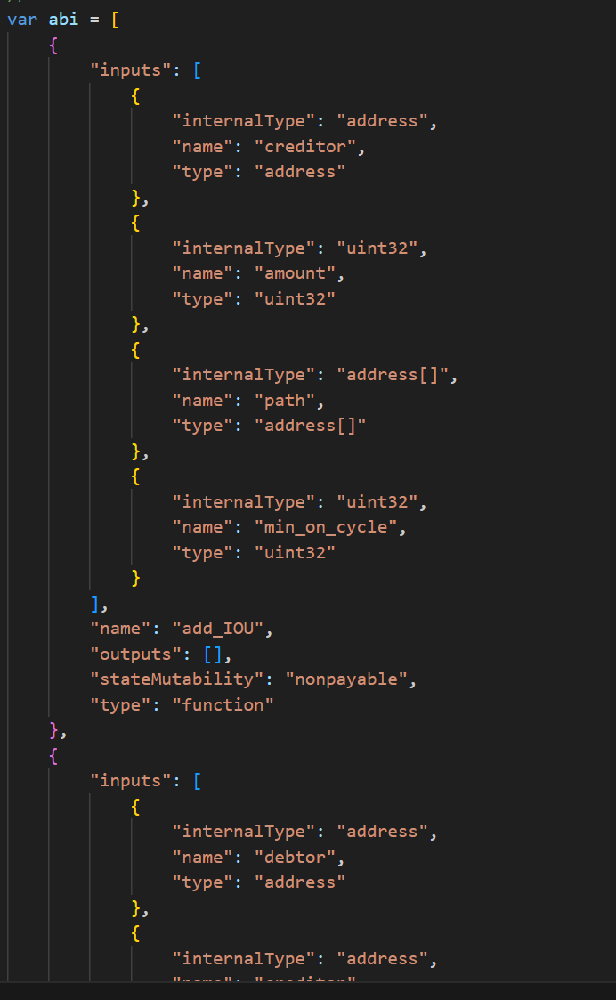
    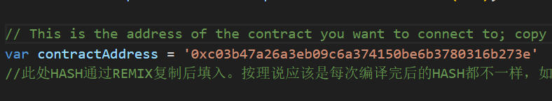
6. 打开`index.html`，初始界面如图所示：
    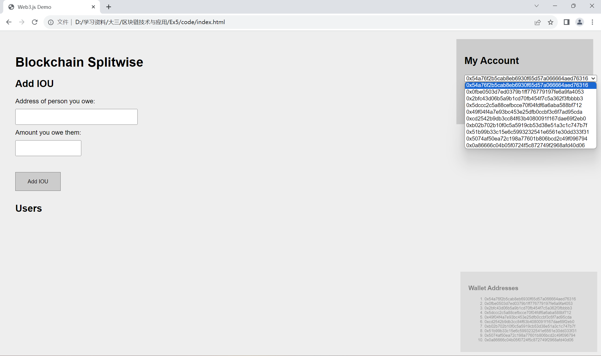
7. 如图所示，界面成功显示，同时10个账户地址也显示在右上角的账户列表中。接下来开始验证功能是否实现，先让1号地址欠2号20以太币。
    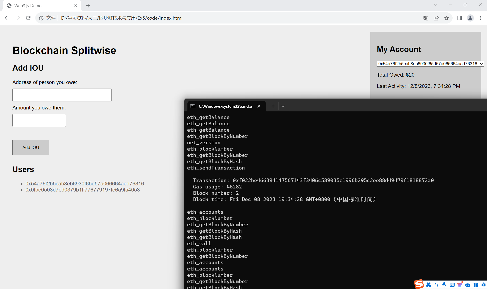
    cmd 中输出了交易哈希，同时用户界面的 **Total Owed** 和 **Last Activity** 也进行了相应更新。然后我们让2号地址欠3号20以太币。
    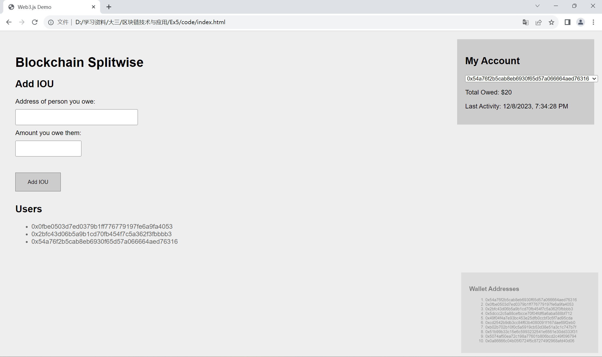
    最后我们让3号欠1号20以太币。那么最终的预期结果应该是3人互不相欠，Total Owed 均为0。
    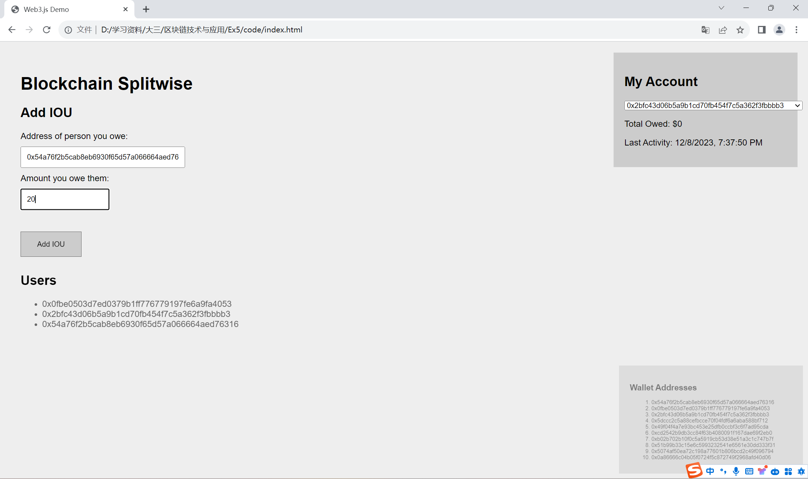
    按下回车，我们依次查看3个用户的 Total Owed。
    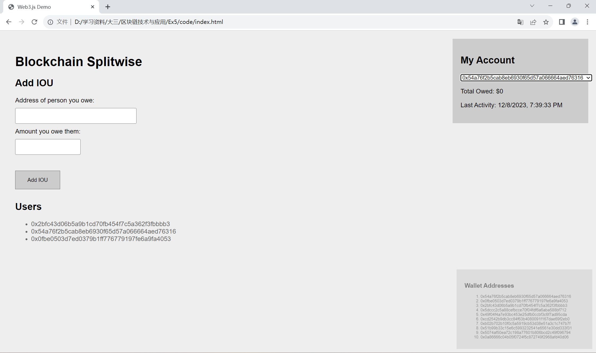
    
    
    从图中可以看到，符合预期，实验顺利完成。
