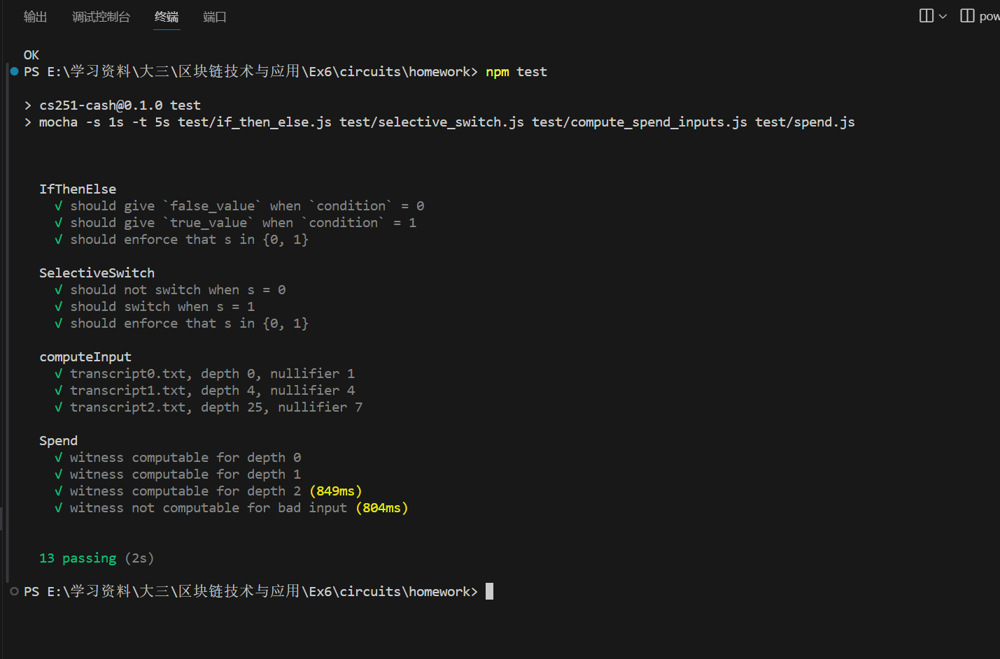
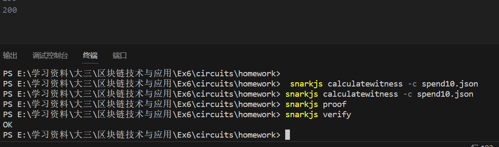

## 区块链第六次实验作业
**小组成员：2112957-罗梓洋 2113946-刘国民**
**代码见homework文件夹**

### 实验简介
本次实验利用 `circom` 和 `snarkjs` 构造 `zk-snark (zero-knowledge succinct non-interactive arguments of knowledge)`，即零知识简洁非交互式知识论证。证明足够短到可以发布到区块链，并且可以被任何有权验证它们的人读取它。


### 核心代码(TODO)
实验指导书中 `writeup.md` 、`verifier_key_factor.json`、 `proof_factor.json` 相关内容用于了解和学习 circom 电路的基础知识，在这里不再赘述。 spend.circom 的代码如下，首先是 IfThenElse 部分模板：
```circom
template IfThenElse() {
    signal input condition;
    signal input true_value;
    signal input false_value;
    signal output out;

    
    condition * (1 - condition) === 0;

    signal diff <-- true_value - false_value;

    out <== condition * diff + false_value;
}
```
circom 中没有分支控制的语法特性，上述代码用于实现一个 if 条件判断的逻辑。当输入信号量 condition 为1时，最终输出结果 out 为 true_value，当 condition 为0时，最终输出结果为 false_value。首先需要保证 condition 只能为1或者0，在 circom 中用 **===** 符号来表示约束条件，之后为保证一阶约束条件，定义了一个辅助信号量 diff 来记录差值。最后将 condition * diff + false_value 赋值给 out，完成 If 的分支逻辑。
```circom
template SelectiveSwitch() {
    signal input in0;
    signal input in1;
    signal input s;
    signal output out0;
    signal output out1;

    s * (1 - s) === 0;

    component firstOutput = IfThenElse();
    firstOutput.condition <== s;
    firstOutput.true_value <== in1;
    firstOutput.false_value <== in0;

    component secondOutput = IfThenElse();
    secondOutput.condition <== s;
    secondOutput.true_value <== in0;
    secondOutput.false_value <== in1;

    out0 <== firstOutput.out;
    out1 <== secondOutput.out;
}
```
按照给出的提示，首先需要保证信号量 s 只能为0或者1，之后利用已经实现的 IfThenElse 模板来给进行赋值。这个地方跟其他语言的函数调用比较类似，**component firstOutput = IfThenElse();** 用来调用一个函数，并给出它的输入值，之后则可以直接使用它的输出值。如果 s 为1，in1 赋值给 firstOutput.true_value，in0 赋值给 firstOutput.false_value。根据 IfThenElse 模板的逻辑，输出则为 true_value，out0则为 in1，secondOutput 的情况同理。
```circom
template Spend(depth) {
    signal input digest;
    signal input nullifier;
    signal private input nonce;
    signal private input sibling[depth];
    signal private input direction[depth];

    // 保存路径上的哈希值
    component computed_hash[depth + 1];
    // 调模板
    computed_hash[0] = Mimc2();
    // H(nullifier||nonce)
    computed_hash[0].in0 <== nullifier; 
    computed_hash[0].in1 <== nonce;
    // 保存经过switch操作后的值，输出拿给Mimc2来哈希
    component switches[depth];

    for (var i = 0; i < depth; ++i) {
        // 调模板
        switches[i] = SelectiveSwitch();
        // 如果direction[i]为1，则sibling[i]在当前节点左边
        // 则in0输入为当前节点哈希，in1为sibling[i]
        // 根据SelectiveSwitch逻辑会交换两个输入然后赋值给两个输出
        switches[i].in0 <== computed_hash[i].out;
        switches[i].in1 <== sibling[i];
        switches[i].s <== direction[i];
        // 调模板
        computed_hash[i + 1] = Mimc2();
        // 依次赋值switch操作后的输出值
        computed_hash[i + 1].in0 <== switches[i].out0;
        computed_hash[i + 1].in1 <== switches[i].out1;
    }
    // 计算出的根节点哈希应该与输入的 digest 相同，满足约束
    computed_hash[depth].out === digest;
}
```
按照所学的构建 Merkle Tree 的方法，为了得到根节点的哈希，我们先用 H(nullifier||nonce) 得到叶子节点，之后不断与当前节点的 sibling[i] 一起哈希即可，这里使用 for 循环来实现。同时需要考虑兄弟节点在左边还是在右边，模板中用 direction[i] 来指示，为了保证正确的哈希顺序，这里需要用到前面实现的 SelectiveSwitch 模板。上述模版需要digest、nullifier、nonce、sibling[depth] 和 direction[depth] 等一系列输入信号。我们通过 Javascript 代码返回的 json 对象来传递输入信号的值。下面是 js 部分的代码：

```javascript
function computeInput(depth, transcript, nullifier) {
  // TODO 
  const tree = new SparseMerkleTree(depth);
  let input_commitment, input_nonce = [null, null];

  // 用循环处理所有交易
  for (let i = 0; i < transcript.length; i++) {
    const commitment_or_info = transcript[i];
    let commitment = null;
    // 长度为1，则代表是已经哈希过的“硬币”值
    if (commitment_or_info.length == 1) {
      commitment = commitment_or_info[0];
    } 
    // 长度为2，则需要调用mimc2进行哈希
    else if (commitment_or_info.length == 2) {
      const [t_nullifier, nonce] = commitment_or_info;
      commitment = mimc2(t_nullifier, nonce);
      // 果找到与提供的nullifier匹配的条目，则记录其commitment和nonce
      if (nullifier == t_nullifier) {
        if (input_commitment != null) {
          // 说明重复给input_comitment赋值了，出现错误
          throw "We should never have duplicates.";
        }
        [input_commitment, input_nonce] = [commitment, nonce];
      }
    } 
    else {// error
      throw "Transcript is invalid + " + str(transcript);
    }
    // error
    if (commitment == null) {  
      throw "null commitment!";
    }
    // 插入树中
    tree.insert(commitment);
  }
  // 遍历完所有的transcript都没找到 nullifer
  if (input_commitment == null) {
    throw "nullifier not found in our transcript";
  }
  // 构造return值
  // 输入值到根哈希的路径
  const path = tree.path(input_commitment);
  const output = {
    digest: tree.digest,
    nullifier: nullifier,
    nonce: input_nonce,
  };
  for (let i = 0; i < depth; i++) {
    let [s, d] = path[i];
    output['sibling[' + i + ']'] = s.toString();
    output['direction[' + i + ']'] = (d) ? "1" : "0";
  }
  return output;
}
```
代码逻辑见注释。这个函数主要用于计算给定的 nullifier（标记币被花费的唯一标识符）在 Merkle 树中的路径，即从叶节点到树根的路径。

### 实验流程
实验在 Windows 操作系统下进行，在以往实验中已经安装过 `Node.js` ，我们直接使用包管理器 `npm` 来安装需要的库和环境。在实验文件夹根目录下依次键入以下命令安装所需要的依赖包。
```shell
npm install -g snarkjs@0.1.11
npm install -g alex-ozdemir/circom#cs251
npm install -g mocha
``` 
上述命令依次安装实验所需要的 `circom` 和 `snarkjs` 包，以及 Javascript 测试框架 `mocha`。最后输入：
```shell
npm test 
```
发现有一些测试中有一些能通过，有一些会报错（也就是实验需要完成的内容）。填入 TODO 部分的代码后，我们再次运行。

可以看到，所有测试成功通过。实际上根据 package.json 文件中的内容：
```json
  "scripts": {
    "test": "mocha -s 1s -t 5s test/if_then_else.js test/selective_switch.js test/compute_spend_inputs.js test/spend.js"
  }
```
**npm test** 命令使用 mocha 工具来对路径下的样例进行测试，这个 shell 运行脚本有点像 makefile ， 全部通过则证明编写的 spend.js 和 spend.cirom 文件执行无误。下面我们尝试用 TUTORIAL.md 给出的方法来一步步生成证明并进行验证。
首先在 homework 目录下，输入命令：
```shell
circom spend10.circom -o spend10.json
``` 
目录下会生成 spend10.json，之后输入：
```shell
snarkjs setup -c spend10.json
```
目录下会生成 proving_key.json 和 verrification_key.json 两个文件。然后为了得到输入的 input.json，切换到 src 目录下，输入命令运行 Node.js:
```shell
node compute_spend_inputs.js 10 ../test/compute_spend_inputs/transcript3.txt 10137284576094 -o ../circuits/homework/input.json
```
后边三个参数即为 js 代码中所对应的三个参数，实验中指定 nullifer 为10137284576094。之后在 homework 目录下即会生成满足 spend 电路输入的 json 文件。切换回 homework 目录，运行命令生成“见证”。
```shell
snarkjs calculatewitness -c spend10.json
``` 
目录下生成 witness.json 文件，继续运行命令：
```shell
snarkjs proof
```
生成 proof.json 和 public.json 文件。最后输入命令：
```shell
snarkjs verify
```
结果如下图，至此验证成功。



